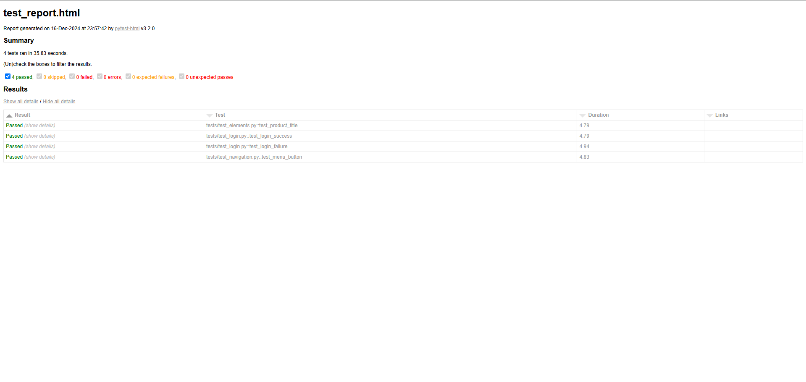

# 🚀 SauceDemo Automation Testing Project

Este proyecto realiza pruebas automatizadas usando Selenium y Python para verificar la funcionalidad básica en la página SauceDemo.

---

## 📝 Características

Incluye los siguientes escenarios de prueba:

1. **Prueba del Login**
   - Validación de usuario válido: `standard_user`
   - Validación de contraseña válida: `secret_sauce`
   - Verificación de mensaje de error con credenciales inválidas.

2. **Prueba de Navegación**
   - Validación de que el botón de menú lateral se abre correctamente.

3. **Prueba de Elementos**
   - Verificación de que el título principal sea: `Products`.

---
## 📁 Estructura del Proyecto

- **saucedemo_automation/**
  - **tests/**  
    Contiene las pruebas automatizadas:
    - `test_elements.py` - Pruebas de elementos.  
    - `test_login.py` - Pruebas de login.  
    - `test_navigation.py` - Pruebas de navegación.  

  - **utils/**  
    - `driver_setup.py` - Configuración del WebDriver.  

  - `requirements.txt`  
    Archivo con las dependencias del proyecto.  

  - `README.md`  
    Documentación del proyecto.
---

## 🔧 Tecnologías Utilizadas

- **🐍 Python 3.x**
- **🌐 Selenium WebDriver**
- **🧪 Pytest** (para ejecutar las pruebas)
- **📊 pytest-html** (para generar reportes HTML)
- **📝 ChromeDriver** (controlador de Chrome)

---

## 🚦 Ejecución de las Pruebas

### 1. Instala las Dependencias

Primero, instala las librerías necesarias con el siguiente comando desde la carpeta raíz del proyecto:

pip install -r requirements.txt

### 2. Ejecuta las Pruebas

Corre todas las pruebas con el siguiente comando:

pytest tests/ --html=reports/test_report.html

Al finalizar, abre el archivo `reports/test_report.html` en tu navegador para verificar el reporte de las pruebas.

---

## 🤝 Contribuir

Si deseas contribuir, sigue estos pasos:

1. Haz un fork del repositorio.
2. Crea una nueva rama con:

git checkout -b mejora/nueva-funcionalidad

3. Realiza tus cambios y haz commit:

git commit -m "Añadida nueva funcionalidad X"

4. Envía tus cambios con:
git push origin mejora/nueva-funcionalidad

---

## 📊 Resultado de las Pruebas

Aquí se muestra el resultado de las pruebas generadas en el archivo `tests_report.html`:

## 👤 Autor

**Eduardo Gallifa Ochoa**

- 🐙 GitHub: [eduardogallifaochoa](https://github.com/eduardogallifaochoa)
- 💼 LinkedIn: [Eduardo Gallifa Ochoa](https://www.linkedin.com/in/eduardogallifaochoa)

---

¡Gracias por revisar este proyecto! 🧪✨
